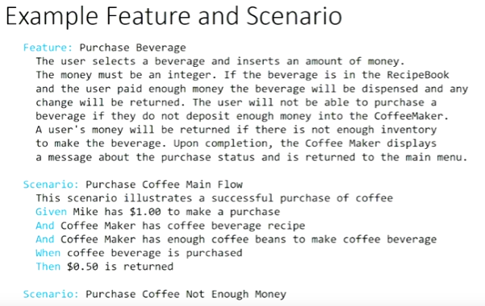

# User story

`As a <role>, I want <feature> so that <reason>`

`Given <context>, when <action> then <result>`

# Gherkin language

```
Feature: Withdraw money from account
Scenario: Jeff withdraws $100 from his account
    Given Jeff has $200 in his account
    When he withdraws $100
    Then Jeff has $100
    And Jeff has $100 in his account
```



One feature per .feature file.
